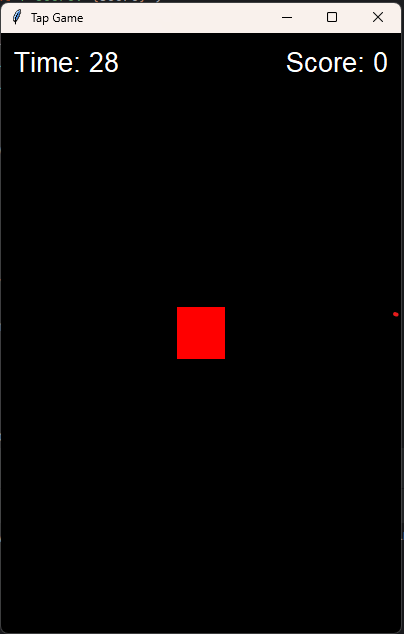

# 🎮 Tap Game (Tkinter + SQLite3)

A simple tapping game built with **Python Tkinter** for the GUI and **SQLite3** for saving player highscores and settings.  

## 📌 Features
- 👤 **Username input** — each player can save their own profile.  
- 🏆 **Highscore saving** — only the highest score for each player is stored.  
- 🎨 **Custom settings** — players can save their preferred box color.  
- ⏱️ **Countdown timer** — you have 30 seconds to score as high as possible.  
- 🔄 **Menu, Restart, and Settings screens** for smooth navigation.  

## 🗄️ Database
- Uses a single SQLite database file: **`user.db`**  
- Table: **`user`**  
  - `id` — unique player ID  
  - `player_name` — the username of the player (must be unique)  
  - `score` — stores the player’s highest score  
  - `box_color` — stores the player’s chosen box color  

## 🚀 How to Play
1. Run the game:
   ```bash
   python main.py

2. Enter your username.
3. Tap the colored box as many times as you can within 30 seconds.
4. At the end, see your **Final Score** or **New Highscore**.
5. Use the buttons to:

   * **Menu** — go back to main screen
   * **Restart** — play again with the same username
   * **Settings** — change username or box color

## 🖼️ Screenshot



## 🔧 Requirements

* Python 3.8 or later
* Tkinter (comes pre-installed with Python)
* SQLite3 (comes pre-installed with Python)

## 📂 Project Structure

```
📁 tkinter-game
 ├── main.py        # main game code
 ├── user.db        # database (auto-created)
 ├── TapGame.png    # screenshot (add your own)
 └── README.md      # documentation
```

## ✨ Future Improvements

* Add sound effects 🎵
* Add difficulty levels 🔥
* Add leaderboard for multiple players 🏅

---

👨‍💻 Created by **SeanMyk17**

